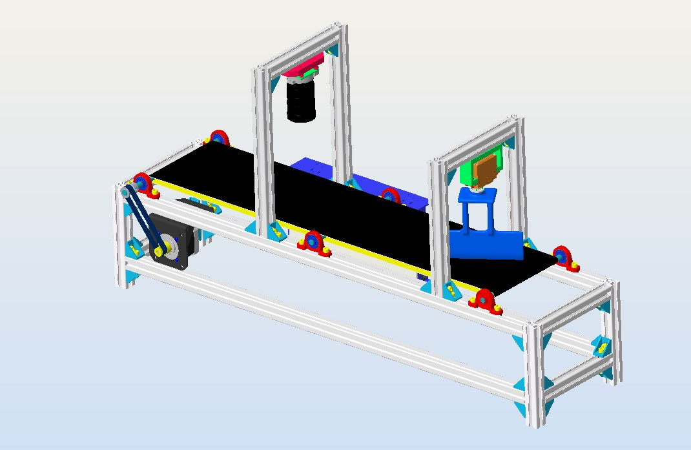

# VisionSort-RPi 🚀  
An intelligent conveyor belt sorting system powered by computer vision and Raspberry Pi. This project combines hardware engineering, object detection, and creative problem-solving to efficiently sort Bolts and Nuts.

---

## 🔍 Overview  
VisionSort-RPi is a DIY conveyor belt system designed to showcase real-world applications of embedded systems and AI. Built using a **Raspberry Pi 5**, **YOLOv8 object detection**, **Hailo AI acceleration**, and custom hardware, the project automates sorting tasks like distinguishing between **Bolts and Nuts** with enhanced inference performance.  

---

## 📐 3D Model Preview 


---

## 🎯 Features  
- **Real-Time Object Detection**: Detects and classifies objects on the conveyor belt using YOLOv8 with Hailo AI acceleration.  
- **Hardware Integration**: Includes NEMA 17 stepper motors for conveyor belt movement and MG996R servo motors for sorting mechanisms.  
- **Custom Dataset Utilization**: Utilizes a pre-annotated dataset of over 9000 images with bounding box labels.  
- **High-Performance Inference**: Leverages the **Hailo AI Kit** to accelerate neural network inference, improving real-time detection efficiency.  
   
---

## 🛠️ Tech Stack
1. **Hardware**: Raspberry Pi 5, Stepper Motors, Servo Motors, Hailo AI Kit, Raspberry Pi HQ Camera, 16mm 10MP Telephoto Lens for Raspberry Pi HQ Camera.  
2. **Computer Vision**: YOLOv8 for object detection.  
3. **Software Tools**:  
   - Python (Primary language)  
   - OpenCV (Image preprocessing)  
4. **AI Training**: Trained YOLOv8 models on a pre-annotated dataset.  
5. **Deployment**: Edge inference on Raspberry Pi using Hailo AI Kit for improved processing speed.  


---

## 🔧 Project Architecture
1. **Data Preparation**:  
   - Used a pre-annotated dataset from **Roboflow**, containing over 9000 images.  
   - The dataset was split into three sets: **Training**, **Validation**, and **Testing**.  
   - Bounding box labels around objects were created using in-built annotation features available in Roboflow.  

2. **Model Training**:  
   - Trained YOLOv8 models on an HPC for optimal detection.  

3. **Hardware Setup**:  
   - Designed a conveyor belt with Raspberry Pi for edge processing.  
   - Integrated stepper and servo motors for automation.
   - Used a **16mm 10MP Telephoto Lens** with the **Raspberry Pi HQ Camera** for precise image capture.  

4. **Deployment**:  
   - Deployed YOLOv8 on the Raspberry Pi 5 for real-time object classification and sorting.
   - Optimized inference performance using the **Hailo AI Kit**, leveraging its neural network accelerator for high-speed processing.  

---

## 🚀 How to Run
1. Clone the repository:  
   ```bash
   git clone https://github.com/yourusername/VisionSort-RPi.git
   cd VisionSort-RPi
   ```

2. Install dependencies:  
   ```bash
   pip install -r requirements.txt
   ```

3. Run the system:  
   ```bash
   python main.py
   ```

4. Place objects on the conveyor belt and watch the sorting in action! 🎉

---

## 🛠️ Skills Demonstrated
1. **Embedded Systems**: Designed and controlled hardware with Raspberry Pi and motors.  
2. **Computer Vision**: Trained and deployed AI models for object detection.  
3. **Data Science**: Utilized a pre-annotated dataset for model training.  
4. **Creative Engineering**: Built a functional DIY sorting system from scratch.  

---

## 🙌 Future Improvements
- Further optimize model accuracy and speed using advanced quantization techniques.  
- Expand dataset to include more object categories for diverse sorting applications.  
- Integrate IoT for remote monitoring.    

---

## 📩 Contact
I’m excited to connect and collaborate!  
- **Email**: [gbrohiith@gmail.com](mailto:your.email@example.com)  
- **LinkedIn**: [https://www.linkedin.com/in/rohiithgb/](https://linkedin.com/in/yourprofile)  
- **GitHub**: [https://github.com/GBR-RL/VisionSort-RPi](https://github.com/yourusername)

---

## 📚 License
This project is open-source and available under the [MIT License](LICENSE).  

---

🌟 **If you like this project, please give it a star!** 🌟

